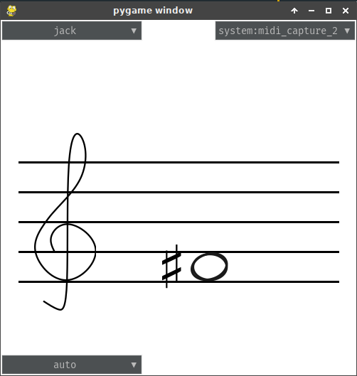
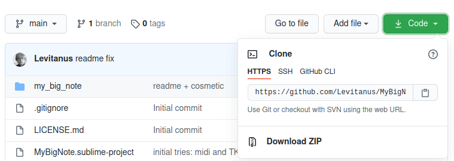
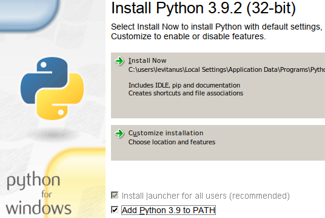

[](https://travis-ci.com/Levitanus/MyBigNote)

# MyBigNote

The very simple app that draws one note that is currently down on the MIDI-keyboard. It was designed for my good friend Nadya Skvortsova to help her in her musical therapy work.

Очень простое приложение, которое отрисовывает одну нотку, которая сейчас нажата на MIDI-клавиатуре. Я его собрал для моей хорошей подруги — Нади Скворцовой, чтобы помочь ей в её музыкально-терапевтической работе.



## Instruction

- Choose midi back-end in the top left corner
- Choose midi device in the top right corner
- If you want to specify the clef — choose it in the bottom left corner

## Инструкция

- Выбрать миди драйвер в левом верхнем углу
- Выбрать миди-устройство (клавиатуру) в верхнем правом углу
- Если нужно использовать конкретный ключ — выбрать его в левом нижнем углу

## Установка

### Установка на Linux

Я очень надеюсь, что у вас Ubuntu или Debian, потому что для других дистрибутивов будут немного другие названия зависимостей в других менеджерах. Но, надеюсь, что всё сработает с первого раза)

У программы есть неприятная зависимость `rtmidi`, для которой надо установить свои зависимости, поэтому сначала устанавливаем их:

```
sudo apt install jackd2 libjack-jackd2-dev libasound2-dev
```

На всякий случай проверяем, что установлены `git` и `pip`:

```
sudo apt install git
sudo apt install python3-pip
```

Ну и напоследок устанавливаем саму программку:

```
pip3 install git+https://github.com/Levitanus/MyBigNote
```

запускаем с помощью:

```
my_big_note
```

В общем случае можно попробовать прямо скопировать всё нижеследуюющее и должно сразу запуститься:


```
sudo apt-get update
sudo apt-get install jackd2
sudo apt-get install libjack-jackd2-dev
sudo apt-get install libasound2-dev
sudo apt-get install git
sudo apt-get install python3-pip
pip3 install git+https://github.com/Levitanus/MyBigNote
my_big_note
```

### Установка на windows

тернистая и не рекомендуется, скоро заменю эту прогармму аналогичной из соседнего репозитория `RustedBigNote`.



Скачать всё и распаковать куда-нибудь

### Вариант «если повезёт»

в папке `dist/windows/my_big_note` лежит файл `my_big_note.exe`. Если повезёт — он запустится и всё будет работать.

### Вариант «если не повезло»

Качаем [это](https://www.python.org/ftp/python/3.9.2/python-3.9.2.exe) и устанавливаем.

**обязательно ставим галочку на «add Python to PATH»**



Потом ищем в меню «Пуск» программу cmd.exe (командная строка)

пишем в ней:

```
pip install -e "путь\к\распакованной\программе\MyBigNote"
```

И потом она должна запускаться также из командной строки, либо: `my_big_note`, либо, если не сработает:

```python "путь\к\распакованной\программе\MyBigNote\my_big_note.py"```

К сожалению, ничего приличне по установке не получается...
